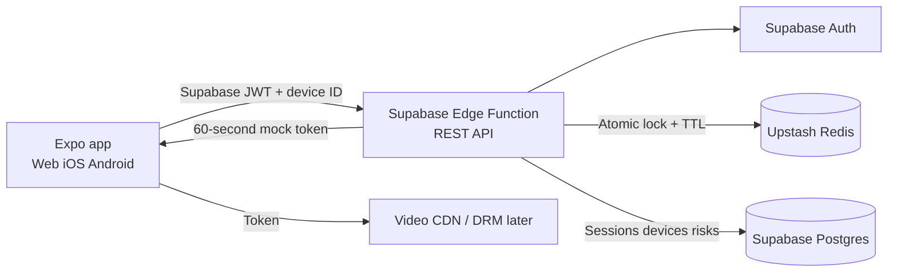
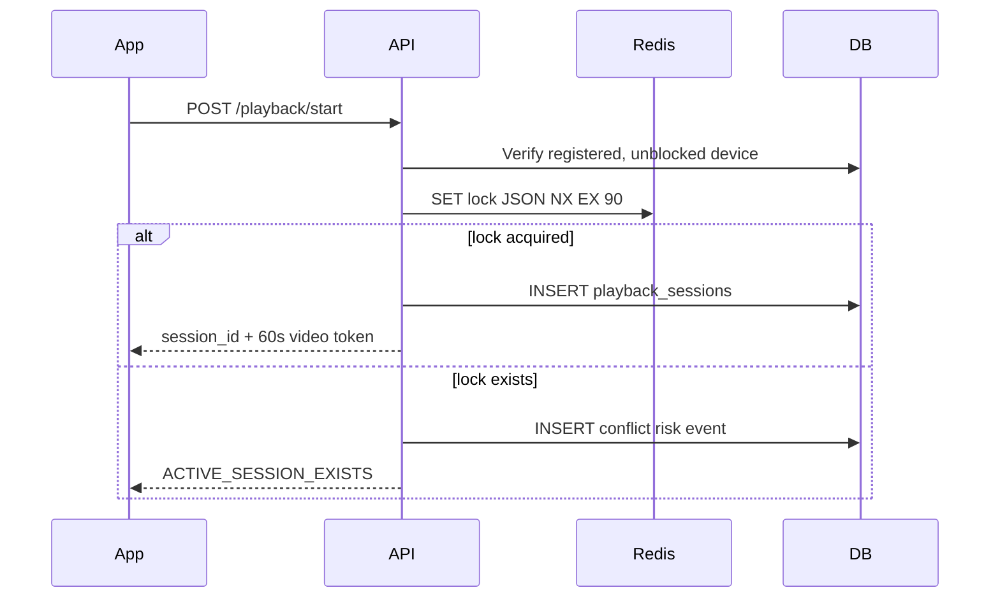
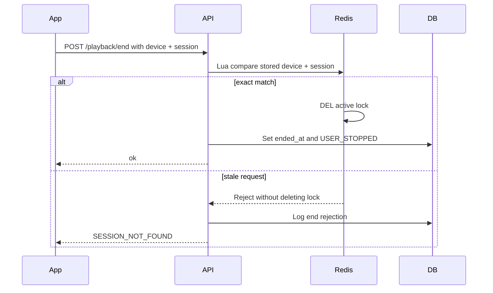

# Playback Prototype Flows

## System architecture



## Start playback



## Heartbeat

```mermaid
sequenceDiagram
  participant App
  participant API
  participant Redis
  participant DB
  App->>API: POST /playback/heartbeat
  API->>Redis: Lua validate user + device + session + version
  alt exact match
    Redis-->>API: Refresh TTL to 90s
    API->>DB: UPDATE last_heartbeat_at
    API-->>App: ok, ttl_refreshed
  else stale or mismatched
    Redis-->>API: Reject
    API->>DB: INSERT heartbeat_rejected risk
    API-->>App: error; stop playback
  end
```

## Conflict and force switch

```mermaid
sequenceDiagram
  participant DeviceA
  participant API
  participant Redis
  participant DB
  participant DeviceB
  DeviceB->>API: Start playback
  API->>Redis: SET NX EX 90
  Redis-->>API: Lock already held by DeviceA
  API-->>DeviceB: Conflict + can_force_switch
  DeviceB->>API: Force switch
  API->>Redis: Atomically replace lock; increment version
  API->>DB: End old session + log FORCE_SWITCH + create new session
  API-->>DeviceB: New session and token
  DeviceA->>API: Old heartbeat
  API-->>DeviceA: SESSION_MISMATCH
```

## Session expiry

```mermaid
sequenceDiagram
  participant App
  participant Redis
  participant API
  participant DB
  App--xAPI: Heartbeats stop
  Redis->>Redis: 90-second TTL reaches zero
  App->>API: Next heartbeat or status request
  API->>Redis: Read active lock
  Redis-->>API: Missing
  API->>DB: Mark session LOCK_EXPIRED
  API-->>App: Session expired; stop video
```

## Safe end playback


