# E-Lern learning-platform UI audit

Date: 2026-07-11

## Verdict

E-Lern already looks credible, calm, and regionally specific enough to present as a learning product. The landing page, navigation shell, course hierarchy, and protected lesson player form a strong visual foundation.

It is not yet a complete learning experience. The product currently emphasizes catalog, access, payment, and playback more than study, practice, mastery, and revision. The most important improvements are to add learning tools around the player, resolve progress and selection ambiguity, increase text sizes, clear notices contextually, and repair mobile overflow/navigation.

Current assessment: visual credibility 7/10; learning usefulness 5.5/10; accessibility confidence 4.5/10.

## Captured flow

### 1. Landing page — healthy

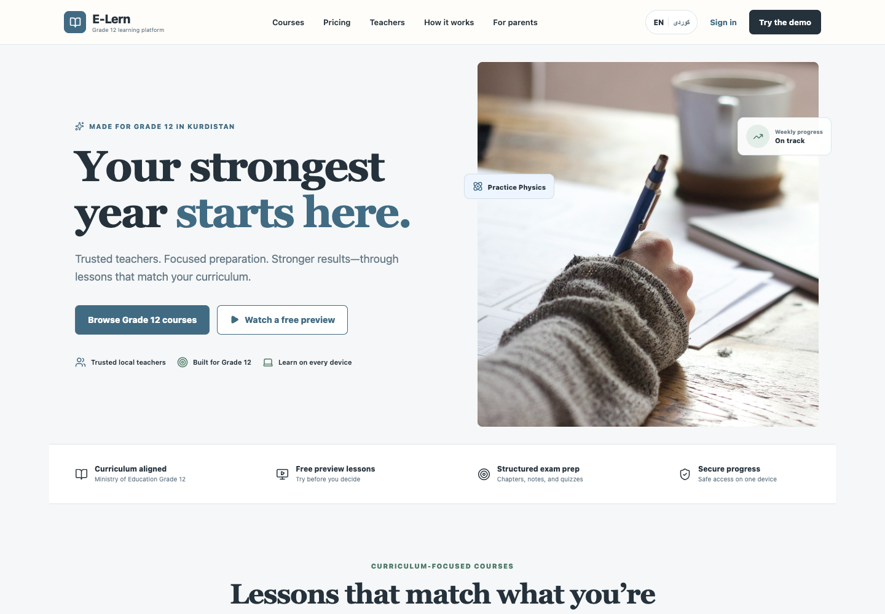

Strong promise, authentic photography, clear Grade 12 positioning, and understandable primary actions. The page becomes pricing-heavy below the fold and should demonstrate quizzes, notes, past questions, and progress more concretely.

### 2. Demo sign-in — healthy for a prototype

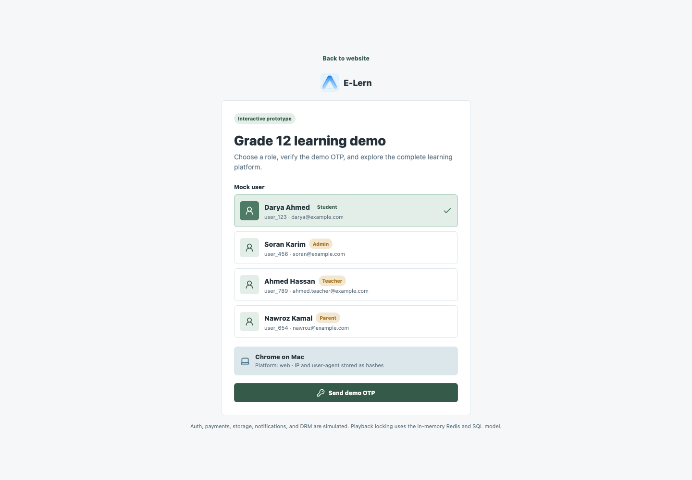

The role choices are clear and the centered form is easy to scan. This is appropriately labeled as simulated, but it must not inform the production authentication design.

### 3. Course discovery — mostly healthy

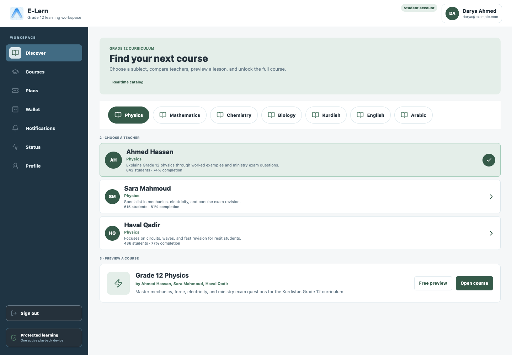

The subject-to-teacher-to-course sequence is understandable. However, selecting one teacher still presents a course taught by all three teachers, so the consequence of teacher selection is unclear. Much of the secondary copy is too small for comfortable reading.

### 4. My courses — needs refinement

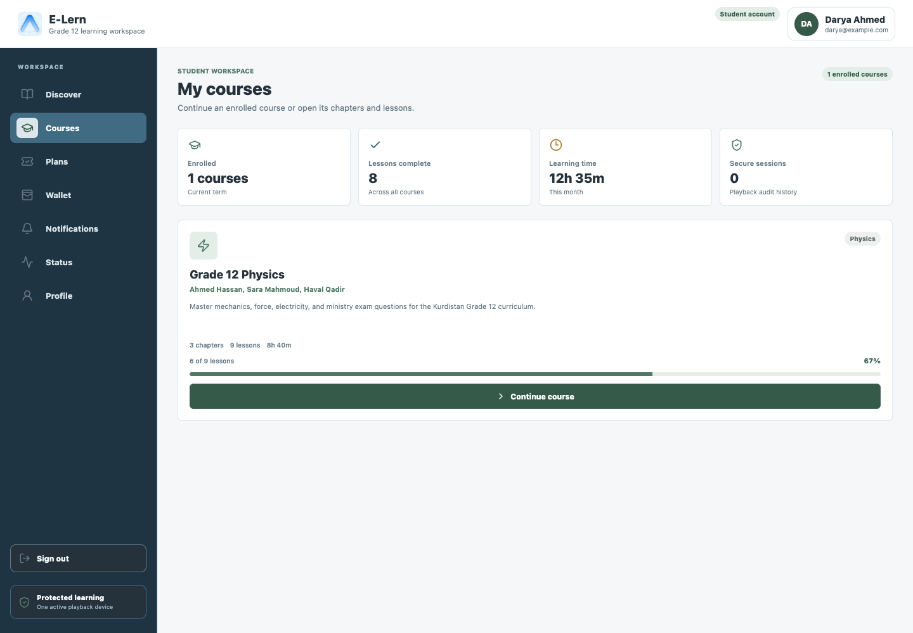

The dashboard makes continuation obvious and progress is visible. The four summary metrics occupy more attention than the actual course. More importantly, `8 lessons complete` conflicts with `6 of 9 lessons` while only one course is enrolled. That damages trust.

### 5. Course detail — healthy foundation

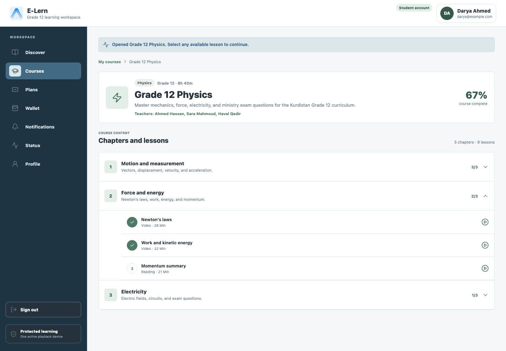

Chapter hierarchy, completion states, lesson types, durations, and playback affordances are easy to understand. Add search, collapse-all, downloads/resources, assessment status, and a clear `Resume lesson` action near the course summary.

### 6. Lesson player — needs learning tools

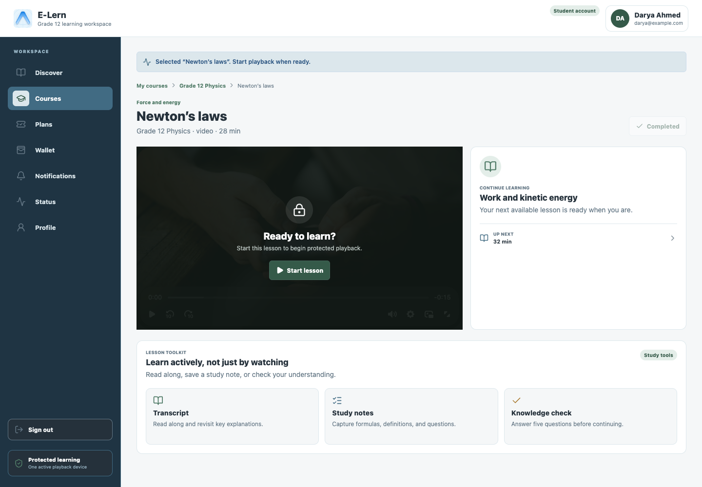

The player is focused and protected playback is communicated well. The screen currently behaves like a video portal rather than a learning workspace. It needs transcript/captions, lesson objectives, notes, attachments, bookmarks, playback speed, questions, and a post-lesson check. Showing `Completed` before the student starts this visit is also confusing.

### 7. Plans — visually strong, cognitively dense

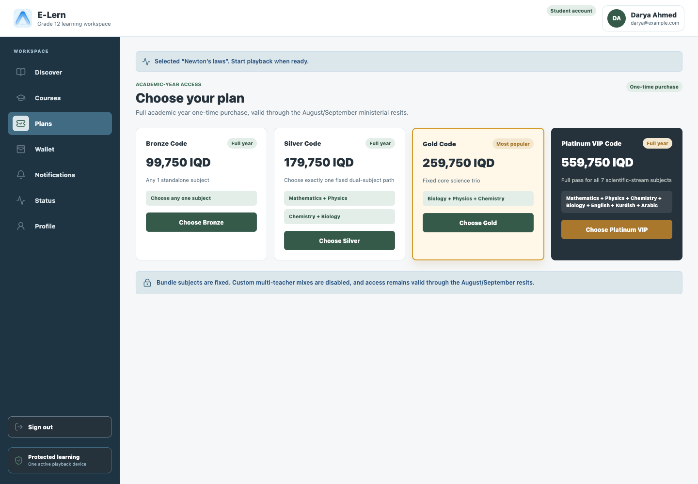

The tiers compare cleanly and the recommended plan is visible. Small typography and dense bundle descriptions make comparison harder. The page needs a simpler subject-first recommendation path for students who do not understand package names.

### 8. Checkout — high-risk ambiguity

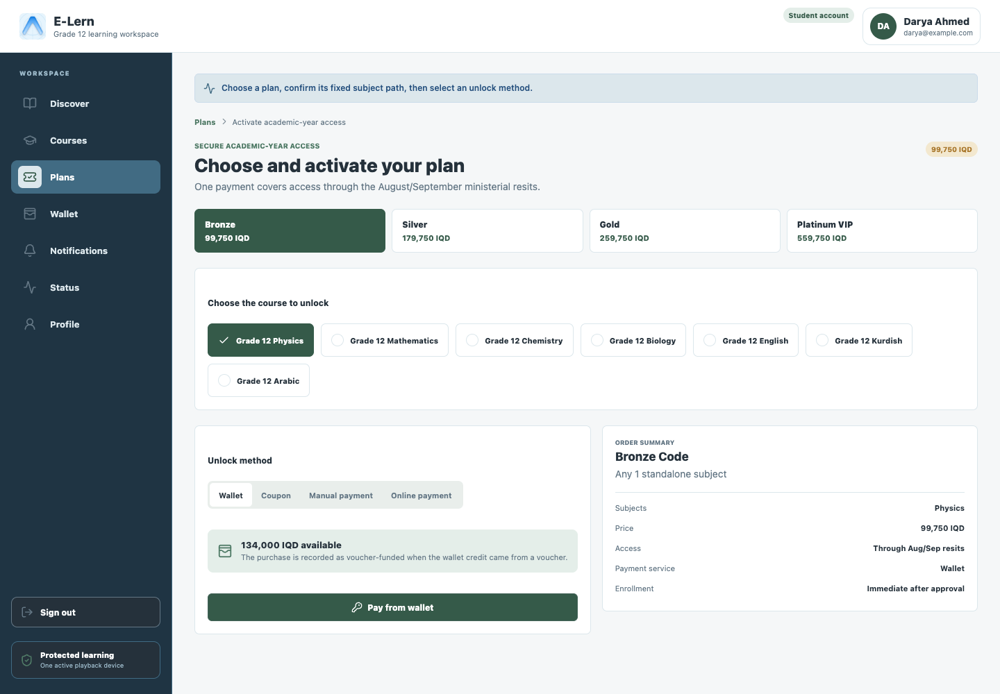

The summary and payment method separation are good. Bronze allows one subject, but every course option displays a check icon; this visually suggests all subjects are selected. Only the active course should show a selected mark. Payment approval language also needs to match the selected method precisely.

### 9. Wallet — healthy

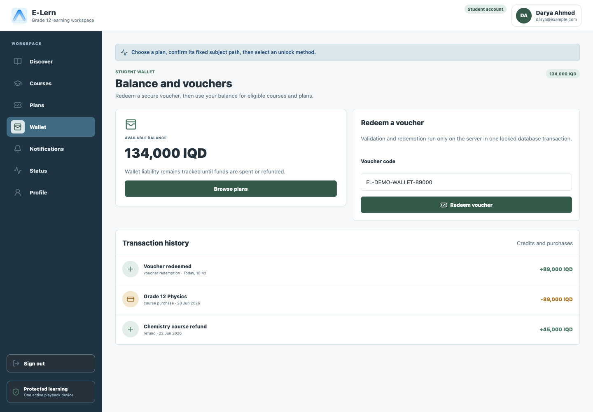

Balance, voucher redemption, and transaction history are clear. The internal phrase `wallet liability remains tracked` is operational language, not student language. Replace it with a concise explanation of where credit can be used and whether it expires.

### 10. Notifications — needs stronger actions

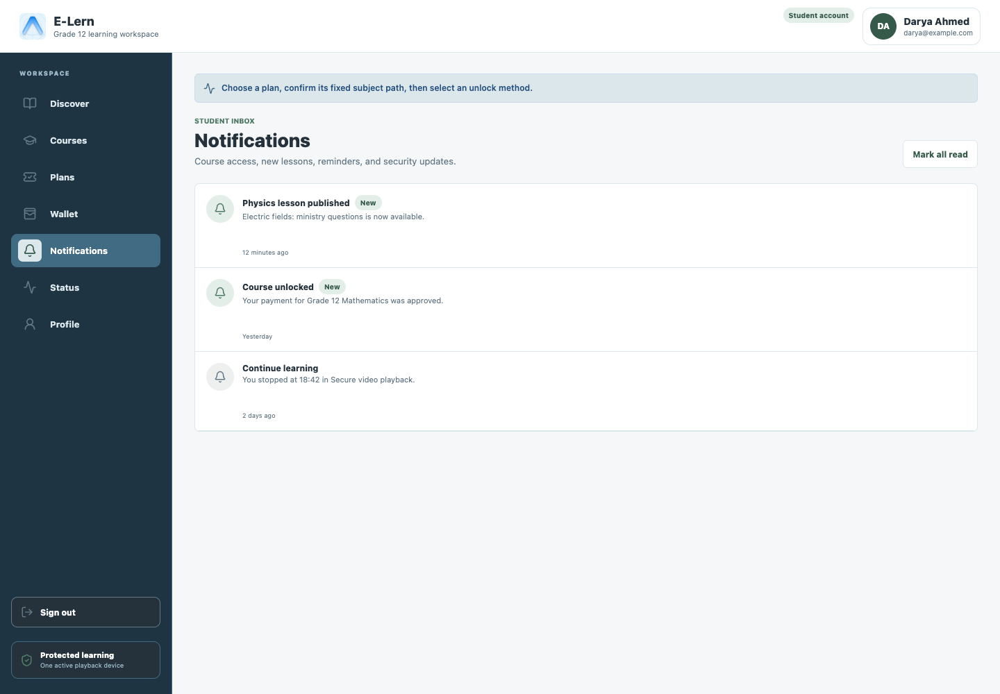

The list is readable and new status is visible. Notifications should deep-link to the relevant lesson, receipt, or resumed playback. The large empty rows and weak timestamps make the page feel unfinished.

### 11. Profile and support — mostly healthy

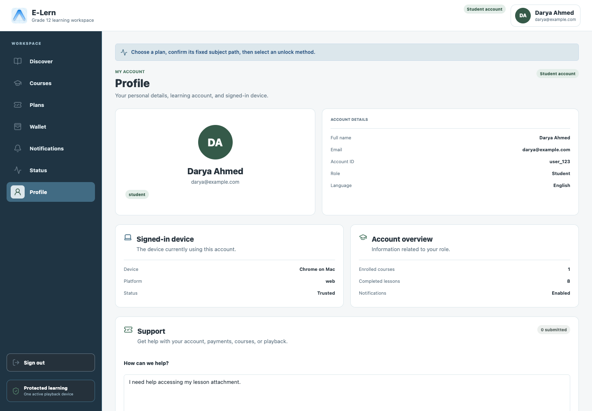

Account information and device trust are clear. The support form is useful, but sensitive identifiers should not be overexposed. Language and appearance controls sit below the captured fold and need real keyboard and screen-reader testing.

### 12. Mobile discovery — needs refinement

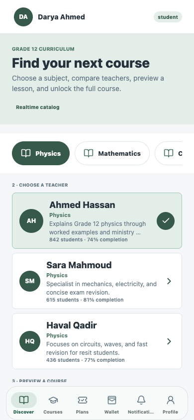

Cards reflow reasonably and bottom navigation is reachable. Subject chips crop abruptly, teacher text truncates heavily, and the course preview is pushed below the fold. The sequence needs stronger compact summaries or progressive disclosure.

### 13. Mobile courses — has overflow

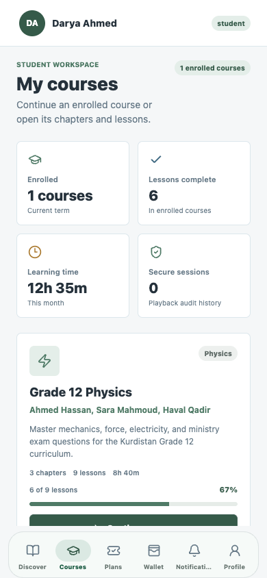

The metric grid and course card fit, but the subtitle visibly runs beyond the right edge. The large course card also pushes the continuation action below the viewport. Text must wrap within the content width and the course card should prioritize resume/progress above metadata.

### 14. Mobile lesson — mostly healthy

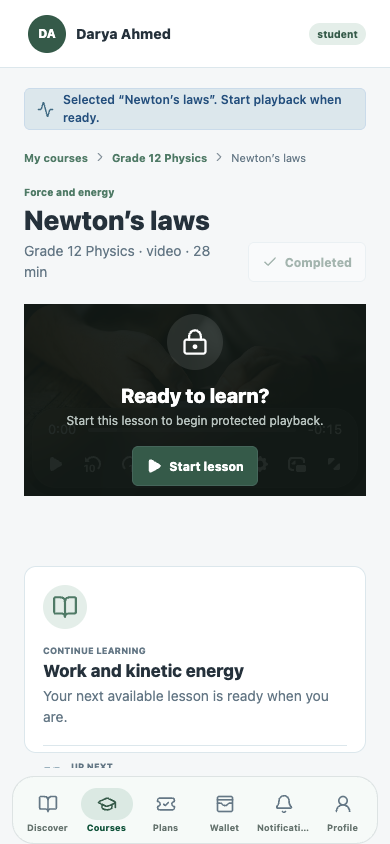

The player remains usable and the primary action is prominent. The `Completed` badge competes with the title, player controls have very low visible contrast, and the oversized next-lesson card consumes too much vertical space.

### 15. Mobile checkout — unhealthy

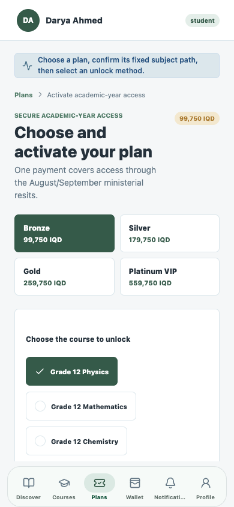

The page title is clipped horizontally, the checkout is extremely tall, and only four bottom destinations remain visible. Notifications and Profile lose obvious navigation access. This flow needs a dedicated mobile structure with a sticky order total/action and compact selectors.

## Highest-impact recommendations

1. Build a real learning layer around playback: objectives, transcript, notes, resources, bookmarks, quizzes, past questions, and mastery feedback.
2. Fix mobile horizontal overflow and ensure every destination remains discoverable.
3. Reconcile progress figures and define one clear model for completed, watched, and mastered.
4. Make selection states unambiguous, especially teacher choice and Bronze course selection.
5. Clear or replace notices when the user changes context; lesson notices must not remain on wallet, notifications, or profile pages.
6. Increase supporting text from roughly 10–12 px to a comfortable 14–16 px baseline and verify contrast.
7. Simplify mobile cards and make `Resume learning` the strongest recurring action.
8. Add contextual actions to notifications and meaningful empty/loading/error states.

## Accessibility evidence limits

The screenshots reveal likely text-size, contrast, overflow, truncation, and target-density risks. They cannot confirm keyboard order, visible focus, semantic headings, screen-reader labels, reduced-motion handling, caption quality, dynamic type, or WCAG compliance. Those require DOM/accessibility-tree inspection and real-device testing.
